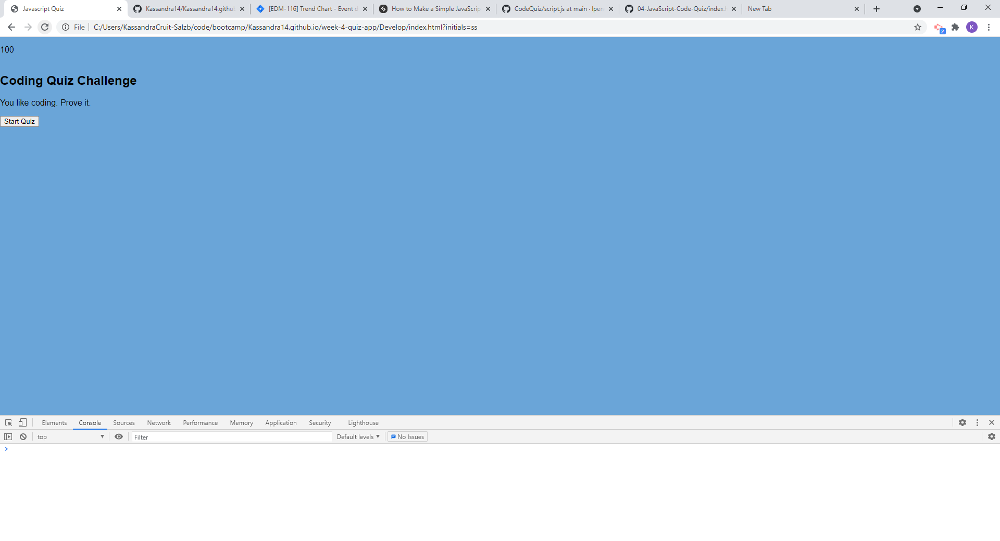

# 04 Web APIs: Code Quiz


## Description

This is a vanilla javascript app - which renders each question and answer, gathers scores to local storage and then displays....also a timer.  

## User Story

```
AS A coding boot camp student
I WANT to take a timed quiz on JavaScript fundamentals that stores high scores
SO THAT I can gauge my progress compared to my peers
```

## Screenshot



## Github Repo:

https://github.com/Kassandra14/quiz-app

## Github deployed app:

https://kassandra14.github.io/quiz-app/Develop/index.html